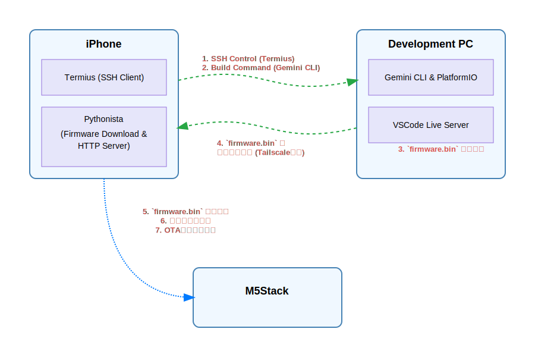

# M5Stack OTAアップデートサンプル (iPhone & Pythonista編)

## 概要

このプロジェクトは、**スマートフォンだけでM5Stackの開発・ビルド・OTAアップデートまでを完結させる**方法を示すサンプルです。

**Tailscale**のようなVPNと、**Gemini Code Assist (CLI)** のようなAIコーディングアシスタントを組み合わせることで、PCの前にいなくても、どこからでも開発作業が可能になります。

iPhoneのターミナルアプリ（例: Termius）から開発PCに接続し、ソースコードの編集からコンパイル、アップデートまでを遠隔で実行します。

## ワークフロー図



## 動作の流れ

1.  **開発・ビルド (スマホから遠隔操作)**
    *   iPhoneのターミナルアプリ（例: Termius）から、**Tailscale経由で**開発PCにSSH接続します。
    *   **Gemini Code Assist (CLI)** を起動し、対話形式で `src/main.cpp` の編集やPlatformIOでのビルドを指示します。

2.  **ファームウェア配信 (PC / 自動)**
    *   開発PC上のVSCodeで **Live Server** 拡張機能が起動しており、ビルドされた`firmware.bin`を配信できる状態になっています。

3.  **ファームウェア中継 (iPhone)**
    *   iPhoneの **Pythonista** アプリが、**Tailscale経由で**PCのLive Serverから`firmware.bin`をダウンロードします。
    *   ダウンロード後、Pythonistaは自身でHTTPサーバーを起動し、iPhoneのテザリングネットワークに接続したM5Stackに向けて`firmware.bin`を配信する準備をします。

4.  **OTAアップデート実行 (M5Stack)**
    *   M5Stackの電源を入れると、iPhoneのテザリング用Wi-Fiに自動接続します。
    *   接続後、iPhone上のPythonistaサーバー（テザリングネットワーク内の`172.20.10.1`）にアクセスし、新しいファームウェアをダウンロードして自身を更新します。
    *   更新完了後、自動で再起動します。

## 必要なもの

*   **ハードウェア**
    *   M5Stack (Core, Core2, StickCなどESP32ベースのもの)
    *   開発用のPC (Windows, macOS, Linux)　※この例ではWindowsを使用
    *   iPhone
*   **ソフトウェア**
    *   Visual Studio Code
    *   PlatformIO IDE 拡張機能
    *   Live Server (VSCode拡張機能)
    *   Tailscale (PCとiPhoneにインストール)　※別のソフトでもできると思います
    *   Gemini Code Assist (CLI) (開発PCにインストール)
    *   Termius などのSSHクライアントアプリ (iPhone)
    *   Pythonista 3 (iPhoneアプリ)　※有料

## セットアップと実行手順

### 1. ソースコードの準備 (PC)

`src/main.cpp` を開き、お使いのiPhoneのテザリング情報に合わせてWi-FiのSSIDとパスワードを修正します。

```cpp
// c:\Users\ns\esp32_ota_test\src\main.cpp

const char* ssid = "***";  // ← ご自身のiPhoneの名前に変更
const char* password = "***";  // ← インターネット共有のパスワードに変更
```

また、SSHの設定やVSCodeのLive ServerやPlatform IOの拡張の導入やライブラリ(M5Unified)の導入などは別途実施します。

### 2. ファームウェアのビルド (PC)

1.  iPhoneのターミナルアプリから開発PCに接続し、このプロジェクトのディレクトリに移動します。
2.  Gemini Code Assist (CLI) を起動し、対話形式でPlatformIOのビルドコマンド (`pio run`) を実行するよう指示します。
    *   (または、手動で `pio run` コマンドを実行します)
3.  ビルドが成功すると、`.pio/build/(環境名)/firmware.bin` というファイルが生成されます。
    *   **(例)** `.pio/build/m5stack-core-esp32/firmware.bin`
4.  (初回のみ) プロジェクトのルートディレクトリに`firmware`という名前のフォルダを作成します。
5.  生成された`firmware.bin`を、作成した`firmware`フォルダにコピーまたは移動します。Live Serverはこのフォルダ内のファイルを配信します。

※初回書き込み時のみ、platformio.iniの設定でUSB接続にする必要があります。

### 3. ファームウェアの配信準備 (PC & iPhone)

この手順では、PCとiPhoneの両方で**Tailscale**が起動し、VPN接続が確立されている必要があります。

#### 手順 3-1: Live Serverの起動とIPアドレスの確認 (PC側)

1.  PCでTailscaleを起動します。
2.  PCの**Tailscale IPアドレス**（`100.x.x.x`形式）を確認します。
    *   **Windows**: タスクトレイのTailscaleアイコンを右クリックし、IPアドレスをコピーします。
    *   **macOS**: メニューバーのTailscaleアイコンをクリックし、IPアドレスを確認します。
3.  VSCodeのウィンドウ右下にある **`Go Live`** ボタンをクリックして、Live Serverを起動します。
    *   (この操作も、Gemini CLI経由で実行することも可能です)
#### 手順 3-2: ファームウェアの中継サーバー起動 (iPhone側)

1.  iPhoneで **Pythonista** アプリを起動し、`pythonista_ota_server.py` という名前で新しいスクリプトを作成（または開き）ます。
2.  以下のコードを貼り付けて保存します。

    ```python
    # pythonista_ota_server.py
    
    import requests
    import http.server
    import socketserver
    import os
    
    # --- ユーザー設定項目 ---
    # 手順3-1で確認したPCのTailscale IPアドレス
    PC_TAILSCALE_IP = "100.x.x.x"  # ← ★★★ PCのTailscale IPアドレスに合わせて変更してください ★★★
    
    # iPhoneのHTTPサーバーが使用するポート (M5Stackのコードと合わせる)
    IPHONE_SERVER_PORT = 8000
    # --- 設定ここまで ---
    
    # --- 固定設定項目 (通常は変更不要) ---
    PC_LIVE_SERVER_PORT = 5500
    # Live Serverで配信されるfirmware.binのパス
    PC_FIRMWARE_PATH = "/firmware/firmware.bin"
    PC_FIRMWARE_URL = f"http://{PC_TAILSCALE_IP}:{PC_LIVE_SERVER_PORT}{PC_FIRMWARE_PATH}"
    
    # PythonistaのDocumentsフォルダ直下にfirmware.binを保存
    IPHONE_LOCAL_DIR = os.path.expanduser('~/Documents')
    LOCAL_FIRMWARE_PATH = os.path.join(IPHONE_LOCAL_DIR, 'firmware.bin')
    # ------------------------------------
    
    class CustomHandler(http.server.SimpleHTTPRequestHandler):
        def __init__(self, *args, **kwargs):
            # HTTPサーバーのルートディレクトリをPythonistaのDocumentsに設定
            super().__init__(*args, directory=IPHONE_LOCAL_DIR, **kwargs)
    
    def download_firmware():
        print(f"PCからファームウェアをダウンロードします: {PC_FIRMWARE_URL}")
        try:
            response = requests.get(PC_FIRMWARE_URL, timeout=30)
            response.raise_for_status()  # HTTPエラーがあれば例外を発生
            
            with open(LOCAL_FIRMWARE_PATH, 'wb') as f:
                f.write(response.content)
            
            print(f"'{os.path.basename(LOCAL_FIRMWARE_PATH)}' のダウンロードが完了しました。")
            print(f"保存先: {LOCAL_FIRMWARE_PATH}")
            return True
        except requests.exceptions.RequestException as e:
            print(f"\n[エラー] ファームウェアをダウンロードできませんでした。")
            print("以下の点を確認してください:")
            print("1. PCでLive Serverが起動していますか？")
            print(f"2. PCのTailscale IPアドレス '{PC_TAILSCALE_IP}' は正しいですか？")
            print("3. PCとiPhoneはTailscaleに接続されていますか？")
            print(f"詳細: {e}")
            return False
    
    def start_http_server():
        with socketserver.TCPServer(("", IPHONE_SERVER_PORT), CustomHandler) as httpd:
            print(f"\n--- iPhone HTTPサーバーを起動しました ---")
            print(f"M5Stackからのアクセスを待機しています...")
            print(f"URL: http://<iPhoneのテザリングIP>:{IPHONE_SERVER_PORT}/firmware.bin")
            print(f"サーバーポート: {IPHONE_SERVER_PORT}")
            httpd.serve_forever()
    
    if __name__ == "__main__":
        if download_firmware():
            start_http_server()
        else:
            print("\nファームウェアのダウンロードに失敗したため、サーバーを起動しません。")
    ```
3.  スクリプト上部の `PC_TAILSCALE_IP` の値を、手順3-1で確認した **ご自身のPCのTailscale IPアドレスに書き換え** ます。
4.  Pythonistaでこのスクリプトを実行（▶ボタン）します。
    *   "ファームウェアのダウンロードが完了しました" と表示されれば、PCからのファイル取得は成功です。
    *   続いて "iPhone HTTPサーバーを起動しました" と表示され、M5Stackからのアクセスを待機する状態になります。

※一度Pythonファイルを実行した後に再度実行する場合、一度Pythonistaを落とし、テザリングの回線も切ってから再度実施するとよいです。

### 5. OTAアップデートの実行 (M5Stack)

1.  iPhoneの **「設定」→「インターネット共有」をオン** にします。
2.  M5Stackの電源を入れるか、リセットボタンを押します。
3.  M5StackがWi-Fiに接続し、アップデートを開始します。PCとUSB接続していれば、シリアルモニターで進捗を確認できます。
4.  アップデートが完了すると、M5Stackは新しいファームウェアで自動的に再起動します。
5.  アップデートが終わったら、Pythonistaのサーバーは停止（■ボタン）して構いません。